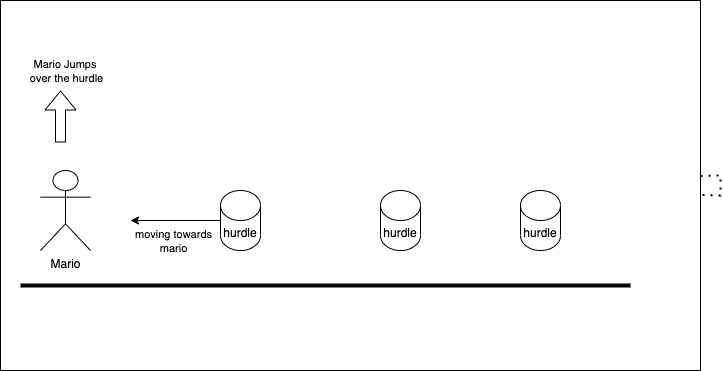

# Project-1
## Game Idea
### Mario Hurdle

Mario is participating a Hurdle game. You have to let Mario run and jump the hurdle at the same time.
Do you think Mario is fast enough to win the race?

## Tech stacks 
- HTML/JavaScript - create a 2D background and character using Canvas.
- CSS - style the character and obstacles

## Wireframes
- Pressing upwards arrow key will make mario jump
- Able to detect Mario hitting the shell

## MVP Goals
- Render the starting point of race
- Render the characters who are joining the race
- Render the hurdles which is going to be obstacles
- Make the player able to run
- Make the player able to jump and pass the koopa shells
- Stop the game if Mario couldn't passed the shells

## Stretch Goals

-  Make more obstacles.
-  Make the game look prettier, in good shape.
-  Pressing space will be a key for sprint